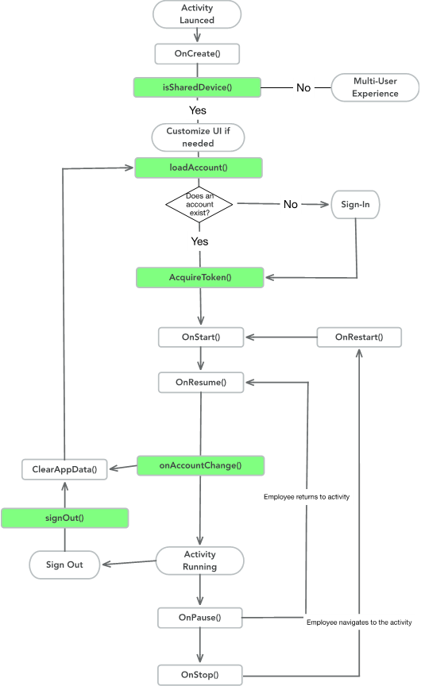
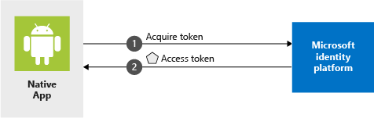

# Use MSAL in an Android app to sign-in users and call Microsoft Graph

| [Getting Started](https://docs.microsoft.com/azure/active-directory/develop/guidedsetups/active-directory-android)| [Library](https://github.com/AzureAD/microsoft-authentication-library-for-android) | [API Reference](http://javadoc.io/doc/com.microsoft.identity.client/msal) | [Support](README.md#feedback-community-help-and-support)
| --- | --- | --- | --- |


## About the Sample

The MSAL Android library gives your app the ability to begin using the [Microsoft identity platform](https://aka.ms/aaddev) by supporting [Azure Active Directory](https://azure.microsoft.com/services/active-directory/) and [Microsoft Accounts](https://account.microsoft.com) in a converged experience using industry standard OAuth2 and OpenID Connect protocols.

This sample walks you through the process of integrating authentication with Microsoft Identity Platform (formerly Azure Active Directory for developers) in your android application. In this sample we'd walk you through the code you need to write in the various lifecycle events of your app to achieve the following objectives.

* Sign-in a user
* Device-wide SSO and Conditional Access support through the Auth Broker
* Select between Single Account Mode and Multiple Account Mode
* How to handle shared device mode
* Get a token for the [Microsoft Graph](https://graph.microsoft.com)
* Call the [Microsoft Graph](https://graph.microsoft.com)
* Sign out the user

## Scenario

This sample app is a [multi-tenant](https://docs.microsoft.com/azure/active-directory/develop/setup-multi-tenant-app) app, which means that it can sign-in users from any Azure AD tenant and Microsoft Accounts.  It also demonstrates how a developer can build apps to connect with enterprise users and access their Azure + O365 data via [Microsoft Graph](https://docs.microsoft.com/graph/overview).
During the auth flow, the users will be required to sign-in first, if it is their first time signing-in to the app, the user would be asked to consent to the [permissions](https://docs.microsoft.com/azure/active-directory/develop/v1-permissions-and-consent) required by the application.

The majority of the logic in this sample shows how to sign-in an end user and make a call to the Microsoft Graph to get basic information about the signed-in user.


## Broker Authentication using MSAL

Microsoft provides applications for every mobile platform that allow for the bridging credentials across applications from different vendors and for enhanced features that require a single secure place from where to validate credentials. These applications are called Brokers. The brokers available for Android are **Microsoft Authenticator** and **Company Portal**.
[Learn more about Brokers here.](https://docs.microsoft.com/azure/active-directory/develop/brokered-auth)

The MSAL for Android will automatically use the broker if they are present on the device.

> **Note:**
> If you have older versions of **Microsoft Authenticator** or **Company Portal** App installed in the device where this sample application will be run, then the user might not be able to test the scenarios presented here. Please make sure that you have installed the latest version of Microsoft Authenticator or Company Portal on your device.

### Single Account Mode

In the `Single Account` Mode, only one user can sign into the application at a time. If the app wants to support just one signed-in user, it is recommended to use the `Single Account` Mode.

The following code snippet from **SingleAccountModeFragment** class shows how the application is set to the `Single Account` Mode in the code:

```java
PublicClientApplication.createSingleAccountPublicClientApplication(
    getContext(),
    R.raw.auth_config_single_account);
```

In the **auth_config_single_account.json** file, the `account_mode` is set as following:.

```json
"account_mode" : "SINGLE",
```

#### Single Account Mode with Shared Device Mode

`Shared Device` Mode will allow you to configure Android devices to be shared by multiple employees, while providing Microsoft Identity backed management of the device. Employees will be able to sign-in to their devices and access customer information quickly. When they are finished with their shift or task, they will be able to globally Sign-Out of the device and it will be immediately ready for the next employee to use.



> [!NOTE]
> Applications that run on Shared Devices must be in Single Account Mode. Applications that only support Multiple Account Mode will not run on a Shared Device.

In the code, you can use the `isSharedDevice()` flag to determine if an application is in the Shared Device Mode. Your app can use this flag to modify UX accordingly.

Code snippet from **SingleAccountModeFragment** class showing usage of the `isSharedDevice()` flag:

```Java
deviceModeTextView.setText(mSingleAccountApp.isSharedDevice() ? "Shared" : "Non-Shared");
```

> [!NOTE]
> You can only [put a device in to Shared Mode](https://docs.microsoft.com/azure/active-directory/develop/tutorial-v2-shared-device-mode#set-up-an-android-device-in-shared-mode) using the [Authenticator app](https://www.microsoft.com/account/authenticator) and with a user who is in the [Cloud Device Administrator](https://docs.microsoft.com/azure/active-directory/users-groups-roles/directory-assign-admin-roles#cloud-device-administrator) role. You can configure the membership of your Organizational Roles by going to the Azure Portal and selecting:
>
> Azure Active Directory -> Roles and Administrators -> Cloud Device Administrator  

## Multiple Account Mode

In the `Multiple Account` Mode, the application supports multiple accounts and can switch between accounts of the user and get data from that user's account.

Code snippet from **MultipleAccountModeFragment** class shows how the application is set in the `Multiple Account` Mode in the code:

```java
PublicClientApplication.createMultipleAccountPublicClientApplication(getContext(),
    R.raw.auth_config_multiple_account);
```

In the **auth_config_multiple_account.json** file, the `account_mode` is set as following:.

```json
"account_mode" : "MULTIPLE",
```

If your app also supports multiple accounts as well as shared device mode, you will have to perform type check and cast to the appropriate interface to perform an operation shown as below.

```java
private IPublicClientApplication mApplication;

        if (mApplication instanceOf IMultipleAccountPublicClientApplication) {
          IMultipleAccountPublicClientApplication multipleAccountApplication = (IMultipleAccountPublicClientApplication) mApplication;
           ...
        } else if (mApplication instanceOf    ISingleAccountPublicClientApplication) {
           ISingleAccountPublicClientApplication singleAccountApplication = (ISingleAccountPublicClientApplication) mApplication;
            ...
        }

```

> [!NOTE]
> If you're writing an application that will only be used on shared devices, we recommend you write your application to  support only the `Single Account` Mode.

For more information on the concepts used in this sample, be sure to read the [Shared device mode documentation](https://docs.microsoft.com/azure/active-directory/develop/shared-device-mode)

## How to run this sample

To run this sample, you'll need:

* Android SDK
* An internet connection
* An Azure Active Directory (Azure AD) tenant. For more information on how to get an Azure AD tenant, see [How to get an Azure AD tenant](https://azure.microsoft.com/documentation/articles/active-directory-howto-tenant/)
    * For Customer Identity and Access Management (CIAM), they will need to designate the tenant as a CIAM tenant as it is being created.
* One or more user accounts in your Azure AD tenant.

## Steps to run the app

> **Note:**
> As a convenience, this sample ships with a default `redirect_uri` preconfigured in the `AndroidManifest.xml` so that you don't have to first register your own app object. A `redirect_uri` is partly based on your app's signing key. The sample project is configured to sign using the included `debug.keystore` so that the provided `redirect_uri` will work.

### Step 1: Clone the code

  From your shell or command line:

```Shell
   git clone https://github.com/Azure-Samples/ms-identity-android-java.git
```

The following steps are for Android Studio. But you can choose and work with any editor of your choice.

 Open Android Studio, and select *open an existing Android Studio project*. Find the cloned project and open it.

### Step 2: Run the sample

From menu, select *Run* > *Run 'app'*. Once the app launches,

1. Click on the hamburger icon

    * Single Account Mode: Select this to explore Single Account  
* Multiple Account Mode: Select this to explore Multiple Account 
    * B2C Mode: Select this to Explore B2C
2. Depending on the mode selected, click on `sign-in` or `Get Graph Data Interactively` or `run user flow` , it takes you to  Sign in (`add account`) page.
3. Sign in with AAD, MSA or B2C account.
4. If this is your first time running the scenario, you will see a consent dialogue. Select 'yes' to proceed.
5. Once successfully signed-in, basic user details will be displayed.

To explore more about the application, follow on screen options.

> **Note:**
> This sample application is configured to run out-of-the-box. To register your own application and run the sample with those settings, follow below steps.

## Register your Own Application (Optional)  

To begin registering your app, start at the [Azure portal](https://aka.ms/MobileAppReg)

To **create** an app registration,  

1. Click `New Registration`.
2. Name your app, select the audience you're targeting, and click `Register`.
3. On the next screen click on `Authentication` and then `Add Platform`.
4. Select `Android` from the options shown on the right hand side.
5. On the 'Configure your Android App' page
    * Enter the Package Name from your Android Manifest.
    * Enter the Signature Hash. Follow the instructions in the portal to generate Signature hash.
    * Click `Configure` at the bottom of the page.
6.  Take note of the ***MSAL Configuration*** as it is used later in `AndroidManifest.xml` and `auth_config.json`.

**Configure** the sample application with your app registration by replacing the sample code in `auth_config.json` and `AndroidManifest.xml`

1. Copy and paste the ***MSAL Configuration*** JSON from the Azure portal into `auth_config_multiple_account.json` under the res\raw folder.

2. Inside the `AndroidManifest.xml`, 
    
    1. replace `android:host` with the package name
    
        ```
        android:host="<packaage_name>"
        ```
    
    2.  replace `android:path` with signature hash.
    
        ```
        android:path="<SignatureHash>"
        ```
    
            - `auth_config.json` contains this information as a reference inside the `redirect_uri` field.
            - The Signature Hash should NOT be URL encoded in the `AndroidManifest.xml`.
        Refer [Azure Active Directory Android Quickstart](https://docs.microsoft.com/azure/active-directory/develop/quickstart-v2-android) for more details

From menu, select *Build* > *Clean Project* and *Run* > *Run 'app'*.

## About the code

The following files have the code that would be of interest to you.

### SingleAccountModeFragment class

Contains code showing how the `Single Account` Mode is implemented. The includes authentication, obtaining the token, and making a Graph api call using the token obtained .

   The following steps provide more details.

1. Create a SingleAccount PublicClientApplication:
    ```java
    PublicClientApplication.createSingleAccountPublicClientApplication(getContext(),
        R.raw.auth_config_single_account,
        new IPublicClientApplication.ISingleAccountApplicationCreatedListener() {
            @Override
            public void onCreated(ISingleAccountPublicClientApplication application) {
                ...
            }
        });
    ```

2. Signing in a user:
    ```java
    mSingleAccountApp.signIn(getActivity(), getScopes(), getAuthInteractiveCallback());
    ```

3. Acquiring token:
    * Interactive:
    ```java
    mSingleAccountApp.acquireToken(getActivity(), getScopes(),getAuthInteractiveCallback());
    ```

    * Silent:
    ```java
    mSingleAccountApp.acquireTokenSilentAsync(getScopes(), AUTHORITY, getAuthSilentCallback());
    ```

4. Calling Graph API to get basic user details and displaying data:
    ```java
    private void callGraphAPI(final IAuthenticationResult authenticationResult) {
        MSGraphRequestWrapper.callGraphAPIWithVolley(
            getContext(),
            graphResourceTextView.getText().toString(),
            authenticationResult.getAccessToken(),
            new Response.Listener<JSONObject>() {
                @Override
                public void onResponse(JSONObject response) {
                    /* Successfully called graph */
                    ...
                }
            },
            new Response.ErrorListener() {
                @Override
                public void onErrorResponse(VolleyError error) {
                    ...
                }
            });    
    }
    ```

5. Sign-out:
    ```java
    mSingleAccountApp.signOut(new ISingleAccountPublicClientApplication.SignOutCallback() {
            @Override
            public void onSignOut() {
                ...
            }
    });
    ```

    When sign-out is performed it removes the signed-in account and cached tokens from this app (or device, if the device
    is in shared mode)

### MultipleAccountModeFragment class

Contains code showing how the `Multiple Account` Mode is implemented. The includes authentication and obtaining the token, and making a graph api call using the obtained token.

1. Create a MultipleAccount PublicClientApplication:

    ```java
    PublicClientApplication.createMultipleAccountPublicClientApplication(getContext(),
        R.raw.auth_config_multiple_account,
        new IPublicClientApplication.IMultipleAccountApplicationCreatedListener() {
            @Override
            public void onCreated(IMultipleAccountPublicClientApplication application) {
                    ...
            }
        });
    ```

2. Acquiring token:

    * Interactive:
    ```java
    mMultipleAccountApp.acquireToken(getActivity(), getScopes(),
                                     getAuthInteractiveCallback());
    ```
    
    * Silent:
    ```java
    mMultipleAccountApp.acquireTokenSilentAsync(getScopes(),
        accountList.get(accountListSpinner.getSelectedItemPosition()),AUTHORITY,
            getAuthSilentCallback());
    ```

3. Get Accounts:
    ```java
    mMultipleAccountApp.getAccounts(new IPublicClientApplication.LoadAccountsCallback() {
        @Override
        public void onTaskCompleted(final List<IAccount> result) {
            ...
        }
    });
    ```

4. Remove account:
    ```java
    mMultipleAccountApp.removeAccount(accountList.get(accountListSpinner.getSelectedItemPosition()),
        new IMultipleAccountPublicClientApplication.RemoveAccountCallback() {
            @Override
            public void onRemoved() {
                ...
            }
        });
    ```

### B2CModeFragment class

Contains code showing how the `B2C` Mode is implemented. The includes authentication and obtaining the token, and making a graph api call using the obtained token.

Because B2C treats each policy as a separate authority, `B2CUser` was introduced to represent a single user that could hold one or more IAccount object for each policies.

If you'd like to use your own app registration, you will also need to update B2CConfiguration.java to match with your configuration json file.

1. Acquire token / run user flow
    ```java
    AcquireTokenParameters parameters = new AcquireTokenParameters.Builder()
            .startAuthorizationFromActivity(getActivity())
            .fromAuthority(B2CConfiguration.getAuthorityFromPolicyName(policyListSpinner.getSelectedItem().toString()))
            .withScopes(B2CConfiguration.getScopes())
            .withPrompt(Prompt.LOGIN)
            .withCallback(getAuthInteractiveCallback())
            .build();

    b2cApp.acquireToken(parameters);
    ```

2. Construct `B2CUser` objects from an account list (obtained from )
    ```java
    b2cApp.getAccounts(new IPublicClientApplication.LoadAccountsCallback() {
        @Override
        public void onTaskCompleted(final List<IAccount> result) {
            users = B2CUser.getB2CUsersFromAccountList(result);
            ...
        }
    });
                    
    public static List<B2CUser> getB2CUsersFromAccountList(@NonNull final List<IAccount> accounts) {
        final HashMap<String, B2CUser> b2CUserHashMap = new HashMap<>();
        for (IAccount account : accounts) {
            /**
            * NOTE: Because B2C treats each policy as a separate authority, the access tokens, refresh tokens, and id tokens returned from each policy are considered logically separate entities.
            *       In practical terms, this means that each policy returns a separate IAccount object whose tokens cannot be used to invoke other policies.
            *
            *       You can use the 'Subject' claim to identify that those accounts belong to the same user.
            */
            final String subject = B2CUser.getSubjectFromAccount(account);

            B2CUser user = b2CUserHashMap.get(subject);
            if (user == null) {
                user = new B2CUser();
                b2CUserHashMap.put(subject, user);
            }

            user.accounts.add(account);
            ...
        }
    }
    ```

3. Acquire token silently (In `B2CUser`)
    ```java
    for (IAccount account : accounts) {
        if (policyName.equalsIgnoreCase(getB2CPolicyNameFromAccount(account))) {
            AcquireTokenSilentParameters parameters = new AcquireTokenSilentParameters.Builder()
                .fromAuthority(B2CConfiguration.getAuthorityFromPolicyName(policyName))
                .withScopes(scopes)
                .forAccount(account)
                .withCallback(callback)
                .build();

            multipleAccountPublicClientApplication.acquireTokenSilentAsync(parameters);
            ...
        }
    }
    ```

4. Sign out (In `B2CUser`)
    ```java
    for (IAccount account : accounts) {
        multipleAccountPublicClientApplication.removeAccount(account);
    }
    ```

### CIAMModeFragment class

This class is used to support CIAM users and confirming that the user can authenticate and get an access token. The CIAM implementation is frequently being updated, so this section of the sample could change in the near future. Please note that at this time, CIAM does not integrate with MS Graph, so we could not fetch MS Graph information in this fragment of the sample app. Instead, we will output the access token to confirm successful authentication. Below is a diaram showing this shortened approach:



This fragment's `acquireToken`, `getAccounts`, `acquireTokenSilentAsync`, and `removeAccount` are similar to those found in `MultipleAccountModeFragment`, but updated to use non-deprecated methods.

> **Note:**
> This fragment reads configuration information from `auth_config_ciam.json`. This JSON uses a tenant that is in-accessible to external developers. To get this fragment of the sample to work, you will have to manual update the `authority_url` field to point towards your CIAM tenant. The url should look like this: "https://login.microsoftonline.com/YOUR.TENANT/"

## Feedback, Community Help, and Support

We use [Stack Overflow](http://stackoverflow.com/questions/tagged/msal) with the community to provide support. We highly recommend you ask your questions on Stack Overflow first and browse existing issues to see if someone has asked your question before.

If you find and bug or have a feature request, please raise the issue on [GitHub Issues](../../issues).

To provide a recommendation, visit our [User Voice page](https://feedback.azure.com/forums/169401-azure-active-directory).

## Contribute

We enthusiastically welcome contributions and feedback. You can clone the repo and start
contributing now. Read our [Contribution Guide](Contributing.md) for more information.

This project has adopted the [Microsoft Open Source Code of Conduct](https://opensource.microsoft.com/codeofconduct/).

For more information seethe [Code of Conduct FAQ](https://opensource.microsoft.com/codeofconduct/faq/) or contact [opencode@microsoft.com](mailto:opencode@microsoft.com) with any additional questions or comments.

## Security Library

This library controls how users sign-in and access services. We recommend you always take the
latest version of our library in your app when possible. We use [semantic versioning](http://semver.org) so you can control the risk associated with updating your app. As an example, always downloading the latest minor version number (e.g. x.*y*.x) ensures you get the latest security and feature enhancements but our API surface remains the same. You can always see the latest version and release notes under the Releases tab of GitHub.

## Security Reporting

If you find a security issue with our libraries or services please report it to [secure@microsoft.com](mailto:secure@microsoft.com) with as much detail as possible. Your submission may be eligible for a bounty through the [Microsoft Bounty](https://aka.ms/bugbounty)
program. Please do not post security issues to GitHub Issues or any other public site. We will contact you shortly upon receiving the information. We encourage you to get notifications of when security incidents occur by visiting [this page](https://technet.microsoft.com/security/dd252948) and subscribing to Security Advisory Alerts.

## Other samples and documentation

* The documentation for the Microsoft identity platform is available from [Microsoft identity platform (v2.0) overview](https://aka.ms/aadv2).

* Other samples for the Microsoft identity platform are available from [Microsoft identity platform code samples](https://aka.ms/aaddevsamplesv2).

* The conceptual documentation for MSAL Android is available from [Microsoft authentication library for android conceptual documentation](https://aka.ms/msalandroid).

* [Shared device mode documentation](https://docs.microsoft.com/azure/active-directory/develop/shared-device-mode)

* [Tutorial: Use shared-device mode in your Android application](https://docs.microsoft.com/azure/active-directory/develop/tutorial-v2-shared-device-mode)

* [Learn more about Brokers](https://docs.microsoft.com/azure/active-directory/develop/howto-v1-enable-sso-android#single-sign-on-concepts)
